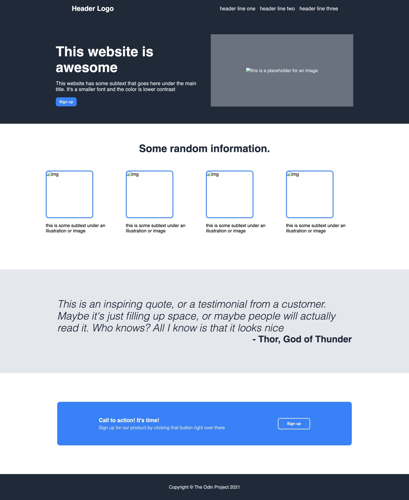

# Landing Page

A simple landing page built as part of [The Odin Project](https://www.theodinproject.com/) curriculum.  
The goal was to recreate a given design using **HTML** and **CSS Flexbox**.

---

## 📸 Preview


Or, view it live on GitHub Pages:  
👉 [Demo Link](https://hemasundar-tatipudi.github.io/landing-page/)

---

## 🛠️ Built With
- HTML5  
- CSS3 (Flexbox)  

---

## 🎯 What I Learned
- Structuring a webpage from a design spec  
- Using **flexbox** for layout (columns, centering, spacing)  
- Applying a style guide (colors, fonts, sizes) consistently  
- Building semantic HTML sections: header, hero, info, quote, call-to-action, footer  

---

## 🚀 Getting Started
Clone the repo and open `index.html` in your browser:

```bash
git clone https://github.com/hemasundar-tatipudi/landing-page.git
cd landing-page
open index.html
````

If you’re on Linux, use `xdg-open index.html`. On Windows, you can simply double-click the file.

---

## 📚 Assignment

This project is part of *The Odin Project* Foundations path.
[Project: Landing Page](https://www.theodinproject.com/lessons/foundations-landing-page)

---